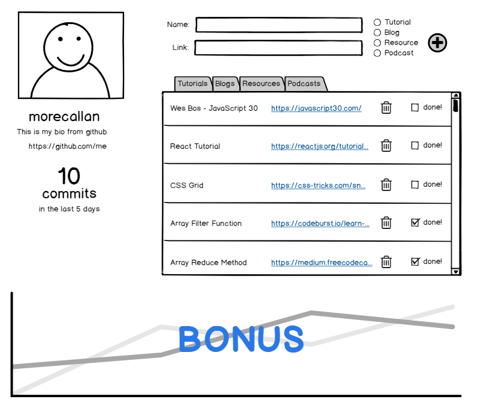

# Developer ++

A portal to gauge your progress as a junior developer and keep track of resources you are interested in.

## Setup

`TODO: Lauren and Zoe to fill this out based on React setup`

## Requirements

- GitHub Calling Card: On page load, the user should see their Github profile, `(TODO: Decide if we want to allow for Users to authenticate with Github OR just add their Github profile when they log in)` it should display their avatar, bio and url. It should also display the # of commits they have over the last 5 days.
- Resource Tracker: This is basically a to-do list for learning materials you find that you want to consume later. The user should have a simple way to add new resources, categorizing them as a tutorial, blogs, documentation, or podcasts. Once added, the different resources should appear in the correct, separate tabs. I should be able to delete these resources or mark them as complete. Complete ones should show at the bottom of the list (but stay in their correct tab). `TODO: Decide if we need to have them doing the full form edit other than the checkbox, because it is a sibling-to-sibling component communication.`
- (BONUS) Tracking Graph: This line graph should track 2 metrics over the last 60 days: commits and resources marked complete. Each line represents one of these. The x-axis should be `days` at a 1 increment. The y-axis should be number of commits/completed resources in 1 increments.
  

