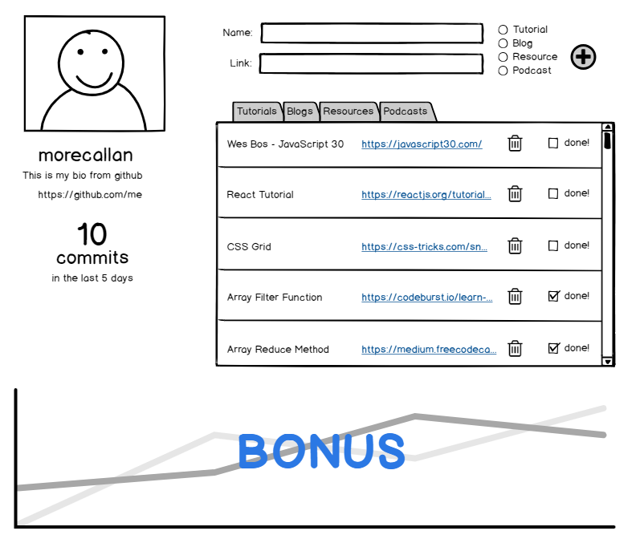

# Part 2: Dashboard CRUD
## Prerequisite

> :warning: This exercise requires you to have completed the [first part](./part1.md) of this exercise.

### GitHub Calling Card:

User Story: As a user, when I log in via GitHub and the page loads, I should see my username, avatar, bio, url, and the number of commits I have made in the last 5 days

On page load, the user should see their Github profile, it should display their GitHub username, avatar, bio and profile URL. It should also display the # of commits they have over the last 5 days.

[Basic User Info: api.github.com/users/{user}](https://developer.github.com/v3/users/)

[User Events (for commits): api.github.com/users/{user}/events/public](https://developer.github.com/v3/activity/events/#list-events-performed-by-a-user)`

### Resource Tracker:
User Stories:
* As a user, I should be able to easily add learning materials I want to consume later.
* When adding a new learning material I should be able to categorize a material as a tutorial, blog, documentation, or podcast.
* As a user, when I am looking at the list of learning materials they should appear in the correct category tab.
* As a user, I should be able to mark resources as completed.  When a resource is marked as completed it should show up at the bottom of the tab it belongs to.
* As a user, I should be able to delete my resources.

### (BONUS) Tracking Graph
User Story: As a user I would like to see a graph with a line representing commits and a line representing resources marked complete over the last 60 days. Each line represents one of these. The x-axis should be `days` at a 1 increment. The y-axis should be number of commits/completed resources in 1 increments.

Check out [Recharts](http://recharts.org/en-US/) as a resource for this (plays well with React).
